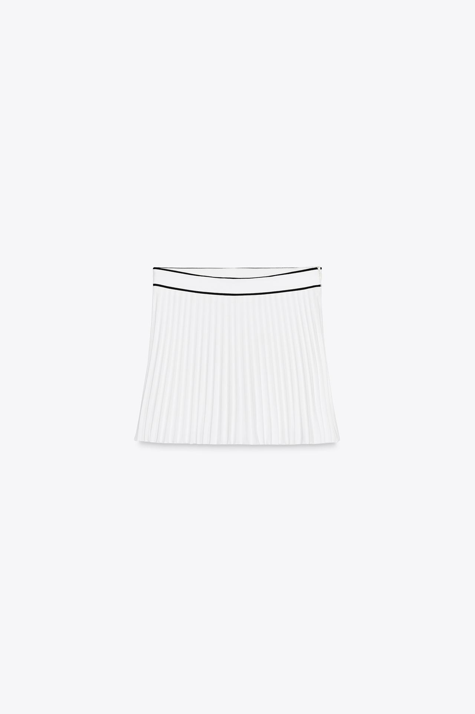
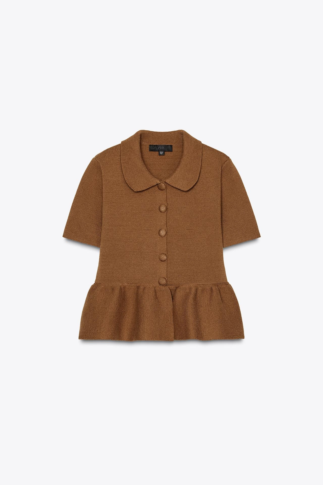
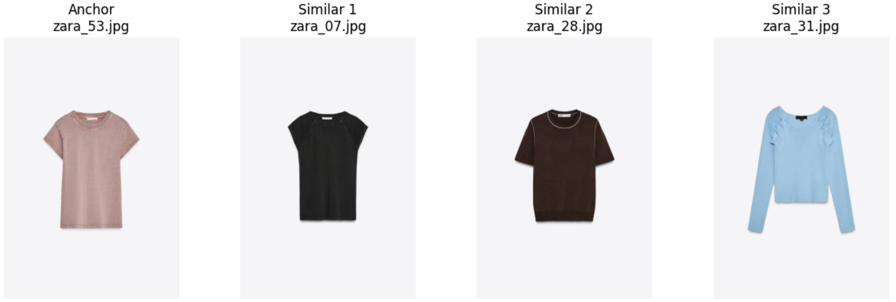
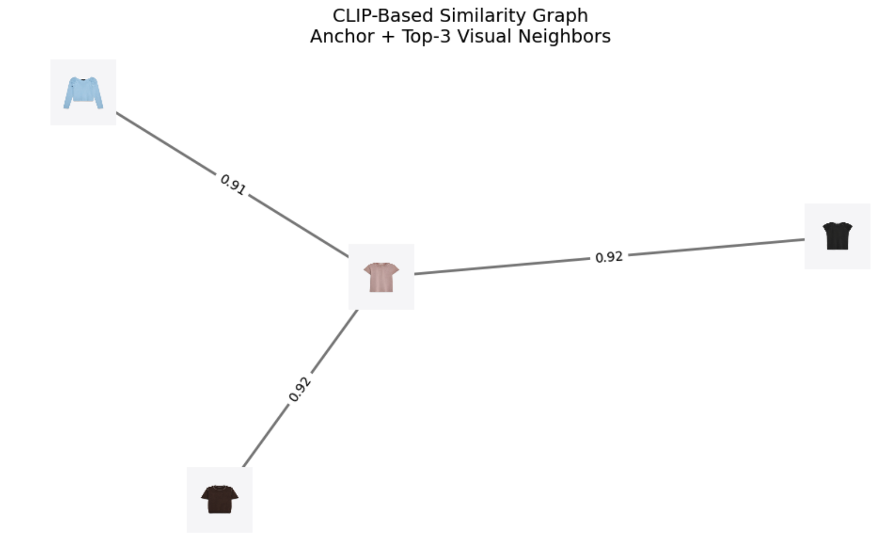
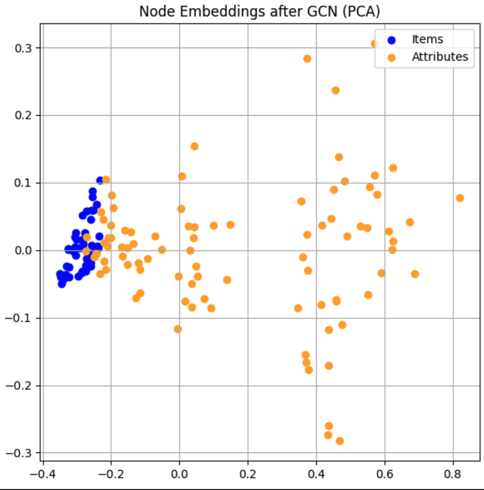
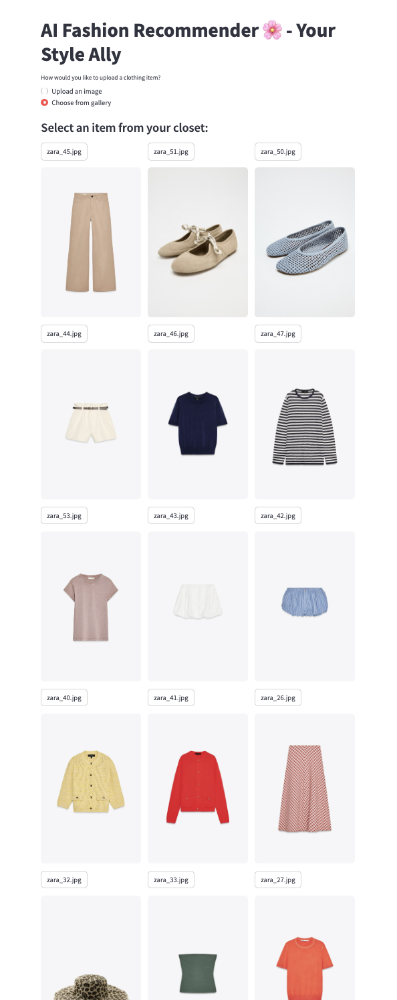
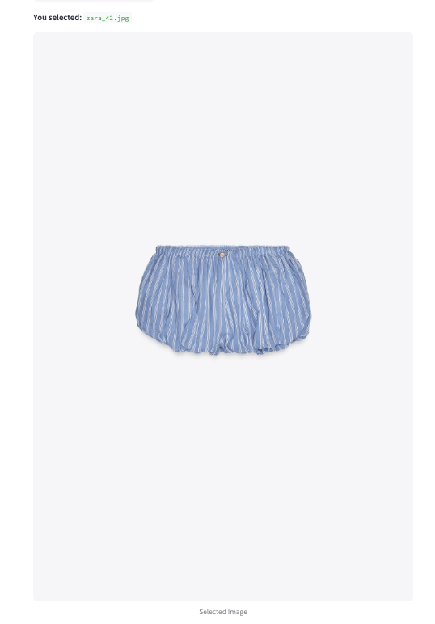
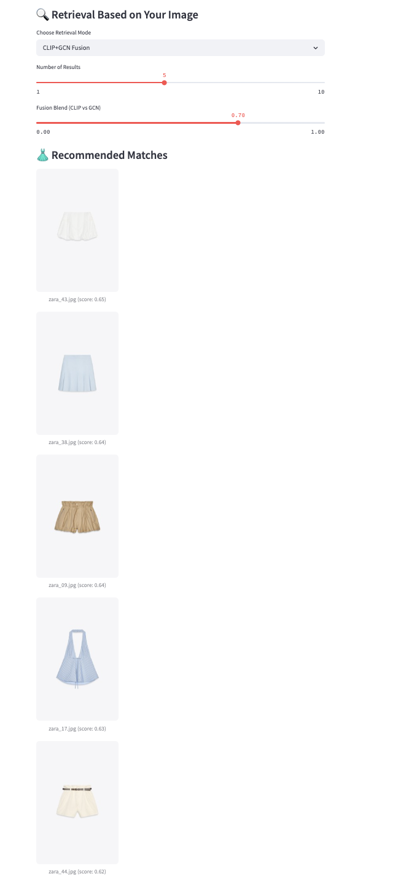
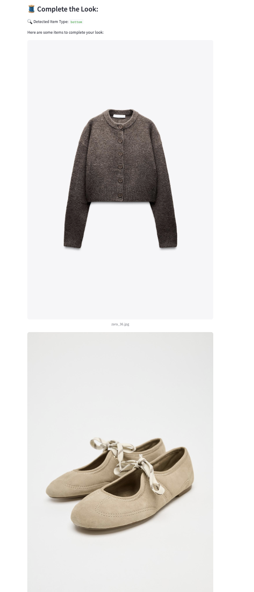

# AI Fashion Recommender – Your Personal Styling Assistant
AI Fashion Recommender is an AI-powered fashion app that helps you complete your outfit with style. Upload a clothing item or choose from your closet gallery, and the app will suggest complementary pieces and similar items to create a complete look.

## Introduction
Fashion Recommenders are behind nearly every shopping experience - from suggesting similar styles to curating entire outfits.  Whether you are browsing a product page or scrolling through a feed, recommendation systems quietly shape what we see next.

In this project, I built a Graph Neural Network (GNN) used for unsupervised fashion recommendation.  The model learns item relationships from co-occurrence data and visual context, allowing it to generate meaningful product suggestions based on learned embeddings.

## 🧩 **Problem Description**
Not everyone has an intuitive sense of style.  Choosing what to wear or even figuring out what goes together can ften feel frustrating and time-consuming.  For many, shopping can be overwhelming, with endless options but little guidance tailored to their personal taste.  This project aims to ease that process by learning patterns in product relationships, and visual aesthetics.  By building a Graph Neural Network (GNN) model that captures the connections between fashion items, we can generate personalized and visually coherent product recommendations.

Instead of hard-coded rules or manual tagging, the model learns from real world data -- how products are styled together or co-appear in scenes to create embeddings that reflect nuanced relationships in fashion.  These embeddings are then used to suggest similar or complementary items that help users discover styles that feel authentic and good to wear.

## 🗂 **Data**
Images from zara.com were downloaded, some of these images are items available in my closet that can be used for testing recommendation.
/data/
/images/ → input images (gallery)

## 🧹 **Data Processing**
- images were renamed
- BLIP captions were not producing accurate captions, and have to be cleaned up for this MVP
- Generate the graph architecture, where
   - `Nodes` : item node i.e. each item image will have an item node
               attribute node i.e. each keyword will correspond to an attribute node
   - `Edges` : item -> attribute edge, and we have iten -> item for item similarity edges

Example of BLIP captions generated: 

`🖼️ zara_05.jpg → a white plea skirt with a black waistband` --> Updated to `a mini white pleated skirt with a black waistband`

`🖼️ zara_06.jpg → a brown jacket with a pepo collar and a pepo pepo pepo pepo pepo` --> Updated to `a knit peplum brown jacket with a peterpan collar`



## 🔍 **EDA**
- When we plot the images in 2D space, we can see how similar items are clustered together.
   - items i.e. sweaters, hats, pants are clustered together
   - and images with models are clustered together


- Sample output from finding similar items using Cosine Similarity



- After running `Graph Convolution Network (GCN)`
   - GCN is a neural network architecture designed to work on a graph-structured data.  It learns `node embeddings` by aggregating information from neighbors in the graph.
   - The final node embeddings are vector representations of each item that encode visual style, and reflect how items relate to each other in the graph.  Below is a visualization
     of the embeddings generated by the GCN.
   


## 🧠 **How It Works (Technical Overview)**
The system combines image captioning, embedding-based retrieval, and rule-based logic to generate outfit suggestions:

- Uploaded or gallery images are processed with BLIP to generate natural language captions
- These captions are mapped to general item types (e.g., “top”, “shoes”) using simple tag-style parsing
- CLIP image embeddings power a visual similarity search, retrieving items with similar styles
- A rule-based logic layer then recommends complementary items based on the detected item type (e.g., matching tops with bottoms)

All components run in a Streamlit UI, designed for both desktop and mobile access.

## ✨ Features

- ✅ **Closet Camera Upload:** Upload your own clothing item image
- ✅ **Gallery Selection:** Browse and select from a gallery of your existing items
- ✅ **Image Captioning with BLIP:** Generates natural language descriptions of uploaded or gallery images
- ✅ **Item Type Detection:** Maps image captions to general clothing categories
- ✅ **Complete-the-Look Recommendations:** Suggests complementary items based on detected type using rule-based logic
- ✅ **Visual Similarity Recommendations:** Retrieve similar items using CLIP image embeddings
- ✅ **Mobile-Friendly UI:** Works across desktop and mobile screens

## 🖼️ **Example Flow**

1. Upload an image of your clothing item **or** select from gallery.

2. Generate caption (powered by BLIP) for item type identification.
3. View detected item type (e.g. “top,” “shoes”).
4. Get recommendations for similar items.


5. View recommendations of complementary items to complete the look.


## 🚀 **Technologies Used**

- Streamlit (UI)
- CLIP (image embeddings for similarity)
- BLIP (image captioning)
- PyTorch
- FAISS (planned integration)
- Python

## 📂 **Project Structure**
```
/data/
/images/ → input images (gallery)
/output/ → saved captions, embeddings
/ src /
   retrieval.py → retrieval functions
   evaluation.py → logging & evaluation utils
app.py → main Streamlit app
```

## 🧾 **Summary**

## 📝 **Known Limitations**

- Caption accuracy may vary 
- Rule-based recommendation logic → may miss nuanced styling contexts
- Gallery UX in progress (currently shows all images every time)
